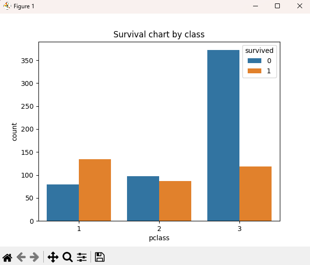
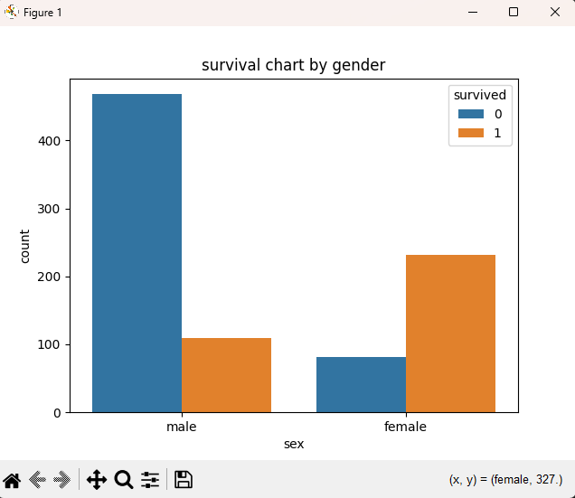

# 📊 Module 4: Exploratory Data Analysis (EDA) – Data Science with Python

Welcome to Module 4 of my Data Science learning journey!  
In this module, I explored the **Titanic dataset** to uncover patterns, clean data, and visualize insights using Python libraries like **Pandas**, **Seaborn**, and **Matplotlib**.

---

## 🧠 What I Learned

- How to load real-world datasets using `seaborn.load_dataset()`
- Handling and cleaning missing data using `dropna()` and `fillna()`
- Exploring dataset shape, types, and stats with `describe()` and `info()`
- Visualizing survival trends and class distributions

---

## 🔧 Tech Stack

- **Language:** Python
- **Libraries:** Pandas, Seaborn, Matplotlib
- **Dataset:** Titanic (comes preloaded with Seaborn)

---

## 📁 Files

- `main.py` – The complete EDA code
- `project.txt` – Notes and learning summary

---

## 📸 Data Visualizations

### 1. 🧍‍ Survival Count


### 2. 🧑‍🤝‍🧑 Survival by Gender


### 3. 🪑 Survival by Passenger Class


> Note: Make sure your `images/` folder contains the screenshots or chart exports as PNGs.

---

## 📈 Example Code Snippet

```python
sns.countplot(x="sex", hue="survived", data=df)
plt.title("Survival by Gender")
plt.show()
